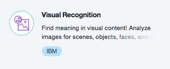
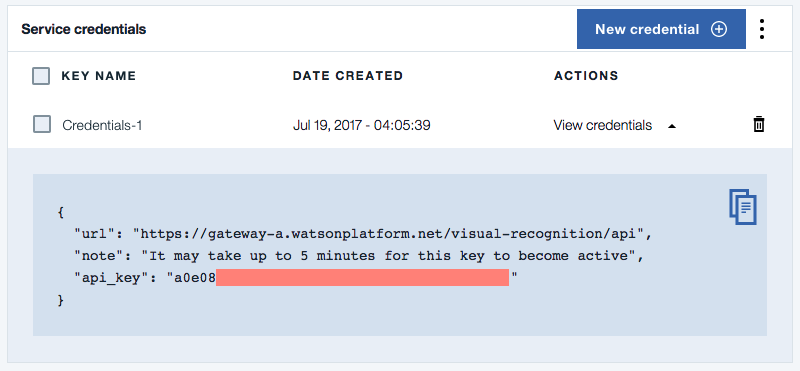

# watson-visual-recognition

**Classify images with Watson**

Get started with the [Watson Visual Recognition](https://console.bluemix.net/catalog/services/visual-recognition) service. This demo will walk you through all of the necessary steps to configure your Watson Visual Recognition service, and run a simple python script to start classifying images. See the world through Watson's eyes!

## Prerequistes

### Python
* [Python 3.6.x](https://www.python.org/downloads/)

### Bluemix
* [Bluemix Account](https://console.bluemix.net/)

## Steps
### Set up the Watson Visual Recognition Service



1. Create an instance of the [Watson Visual Recognition](https://console.bluemix.net/catalog/services/visual-recognition) service.

2. Enter a unique `Service name` and click `Create`.

3. Once created, click `Service Credentials` from the left-hand side menu.

4. Expand the `View credentials` and copy the `api_key`.



### Set up your python script locally

1. Copy the `visual.py` script in this repo locally to your machine.

```python
import json
from watson_developer_cloud import VisualRecognitionV3

# Create an instance of your Watson Visual Recognition service
instance = VisualRecognitionV3(version='2016-05-20', api_key='<YOUR_API_KEY>')

# Classify the image using Watson Visual Recognition
img = instance.classify(images_url='<IMAGE_URL>')

# Print the JSON results
#print(json.dumps(img, indent=2))

# Format the results to be more readable
for results in img['images'][0]['classifiers'][0]['classes']:
    print('\n There is a ' + str(round((results['score']*100),1)) + ' percent chance the image contains: '+ results['class'])
```

2. Replace the `<YOUR_API_KEY>` with the `api_key` from your Watson Visual Recognition service created earlier.

3. Install the `watson_developer_cloud` python package.

```
$    pip install watson_developer_cloud
```

4. Find an image url online you would like to classify. Replace `IMAGE_URL` in your `visual.py` script with the link.

### Start classifying images

1. Run your script.

```
$    python visual.py
```

2. Using a picture of a baby elephant, the output would be similar to the following.

```
$    python visual.py 

 There is a 84.1 percent chance the image contains: African elephant

 There is a 93.1 percent chance the image contains: elephant

 There is a 94.6 percent chance the image contains: pachyderm (thick skinned hoofed)

 There is a 94.6 percent chance the image contains: mammal

 There is a 98.7 percent chance the image contains: animal

 There is a 73.7 percent chance the image contains: young mammal

 There is a 76.2 percent chance the image contains: young

 There is a 50.0 percent chance the image contains: Indian elephant

 There is a 96.8 percent chance the image contains: gray color
```

3. Simply update the image url and run the script again to classify a new image.

## Next Steps
* Check out the other [Watson Visual Recognition APIs](https://github.com/watson-developer-cloud/python-sdk/tree/master/examples/visual_recognition_v3.py)
  * `instance.detect_faces(...)`
  * `instance.recognize_text(...)`
  * And more!
